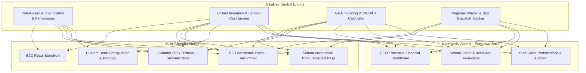

# Software Requirements Specification (SRS) & System Architecture
**Client:** Naito De Saint Enterprise (Trading as **Desaint Stationeries**)  
**Founder & CEO:** Mr. Aseim Solomon (Sunyani, Ghana)  
**Engineering Team:** SikaDev Software Engineering  
**Version:** 1.0 (Based on Client Discovery Submission)  
**Date:** September 2026  

---

## 1. Executive Summary & Client Goals
Desaint Stationeries is a high-volume educational supply, printing, customization, and distribution enterprise based in Sunyani, serving schools, bookshops, and institutions across Bono, Ahafo, Ashanti, Central, Western North, Oti, and Northern Ghana.

### Key Discovery Insights from Mr. Solomon:
1. **Scale:** Custom exercise book print runs are between **5,000 to 10,000 copies per order** (High-volume B2B & Institutional contracts).
2. **Timeline:** Customization ordering window ramps up in **February annually**.
3. **Core Scope:** Desaint requires all 4 sales channels (Retail, B2B Wholesale, Institutional School Supply, Counter POS), plus all 5 payment methods and 4 fulfillment routes.
4. **Key Priority ("Managerial Aspect"):** Comprehensive executive management oversight, staff role access control, profit margin analytics, credit/receivables tracking for schools, and inventory reconciliation across channels.

---

## 2. Functional Architecture & Module Breakdown

---

## 3. Detailed Module Specifications

### Module 1: Multi-Channel Commerce & Pricing Engine
- **B2C Retail:** Public web catalog for students, teachers, parents with retail pricing and cart checkout.
- **B2B Wholesale:** Secure login for retail bookshops and distributors with carton/case bulk volume pricing.
- **Institutional School Supply:** School procurement portal for issuing formal proforma invoices and purchase orders.
- **Walk-in Counter POS:** Fast cashier interface for the Sunyani physical shop with thermal/A4 sales receipt generation.
- **Stock Visibility Rule:** Public catalog renders **Status Badges Only** (*"In Stock"*, *"Available on Order"*, *"Backorder Allowed"*), strictly concealing literal low counts from the public.

---

### Module 2: School Book Customization & Graphic Proofing Workflow
- **Online Configurator:**
  - School Crest / Logo upload (PNG, JPG, PDF).
  - Ruling selection:
    - Standard Exercise (40, 60, 80 pages - single/broad line)
    - Note 1 & Note 3 (120 to 200 pages - hard/soft cover)
    - Pre-School & Kindergarten (double line, grid, tracing, drawing)
    - Graph & Sketch books
  - Volume selection enforcing client MOQ of **5,000 – 10,000 pcs**.
  - Dynamic Plate Setup Fee logic: **Free for orders above 1,000 copies** (as selected by Mr. Solomon).
- **Digital Proofing & Approval Portal:**
  - SikaDev graphics workflow allows staff to upload cover artwork proofs.
  - School administrator/proprietor receives an approval link with digital signature/checkbox sign-off before printing begins.

---

### Module 3: Ghana Financial & Invoicing System
- **GRA Dual Mode Invoicing:**
  - **Standard Mode:** 15% VAT + 2.5% NHIL + 2.5% GETFund + 1% COVID Levy (~21.9% total) for corporate and government tenders.
  - **Retail Mode:** Simplified net receipts for counter sales and retail walk-ins.
- **Statutory Withholding Tax (Act 896):**
  - Institutional proformas automatically calculate and display the **3% WHT (Goods)** deduction line item, showing Gross Total, WHT Withheld, and Net Payable by the School.
- **Payment Rails:**
  - Automated Mobile Money (MTN MoMo & Telecel Cash via Paystack / Hubtel gateway).
  - Manual MoMo merchant verification (Transaction ID input).
  - Direct Ghana Commercial Bank transfer instructions printed on invoices.
  - Cash on Delivery / Counter cash for Sunyani clients.
  - 30-Day Institutional Credit Ledger for vetted schools.

---

### Module 4: Regional Logistics & Waybill Tracking
- **Distribution Routes:** Sunyani hub routing to Bono, Ahafo, Bono East, Ashanti, Central, Western North, Oti, and Northern Ghana.
- **Fulfillment Types:**
  - **Bus Terminal Parcel Dispatch:** Tracks parcel booking with bus companies (VIP, OA, Imperial, Metro Mass) including Waybill Number, Destination Station, and Driver/Conductor contact.
  - **Direct Institutional Truck/Van:** Bulk campus deliveries with driver dispatch manifest.
  - **In-Store Pickup:** Sunyani counter collection notifications.
  - **City Courier / Rider:** Fast dispatch within Sunyani municipality.

---

### Module 5: "Managerial Aspect" — Executive Management Suite
*Directly addressing Mr. Solomon's specific request:*
- **CEO Dashboard (Mr. Solomon's Eyes):**
  - Daily, weekly, monthly gross revenue and net profit margins.
  - Top-selling stationery products and active school printing orders.
  - Cash flow breakdown: MoMo gateway vs Cash counter vs Bank transfers.
- **School Credit & Receivables Ledger:**
  - Track which schools received supplies on credit for the term, amount paid, outstanding balance, and payment due dates.
- **Staff Roles & Permissions:**
  - **Super Admin (CEO):** Full control, financial reports, margin overrides.
  - **Branch / Shop Cashier:** POS sales, counter receipts, inventory lookup (no margin access).
  - **Production / Graphics Manager:** Manage artwork proofs, print queues, and custom order status.
  - **Logistics Officer:** Waybills, parcel drop-offs, delivery status.

---

## 4. Technical Stack & Deployment Architecture
- **Backend:** Python 3.12 / Django 5 (Robust ORM, secure authentication, native admin capabilities).
- **Database:** PostgreSQL (production) / SQLite (offline development).
- **Frontend:** Responsive HTML5 / CSS3 / Vanilla JavaScript + Bootstrap (Offline-first assets bundled locally).
- **Payments:** Paystack / Hubtel REST API integration + Manual Webhook verification.
- **Hosting & Infrastructure:** Cloud deployment with daily automated database backups and custom SSL on `desaintstationeries.com`.
