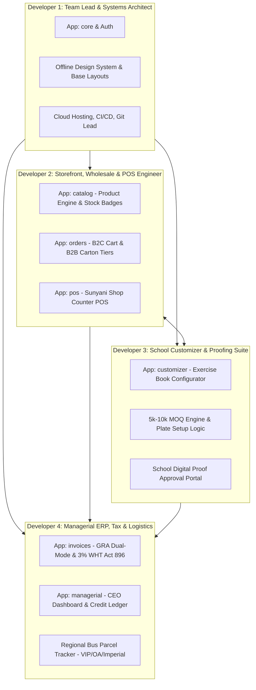

# Desaint Stationeries — Startup Dev Team Engineering Plan & Scope Breakdown
**Project:** Comprehensive Digital Supply Chain, Multi-Channel Commerce & Managerial ERP  
**Client:** Naito De Saint Enterprise (Trading as **Desaint Stationeries**, Sunyani)  
**Contract Value:** GH₵ 5,000 Net (Milestone 1: 50% GH₵ 2,500 | Milestone 2: 30% GH₵ 1,500 | Milestone 3: 20% GH₵ 1,000)  
**Timeline:** 14 Days Rapid Delivery Guarantee  
**Team Composition:** 4 Startup Developers (Team Lead + 3 Dev Mates)  

---

## 1. Squad Architecture & Role Allocation

To eliminate code collisions and enable parallel development, each engineer owns an isolated Django application with clean model and template boundaries:

---

## 2. Detailed Developer Tracks & Deliverables

### 🧑‍💻 Developer 1: Team Lead & Systems Architect (You)
**Apps Owned:** `config/`, `core/`, `accounts/` (Authentication & Roles)  
**Responsibilities:**
1. **Foundation & Repo Scaffolding:**
   - Initialize the Django project structure, settings, and environment configuration (`.env`).
   - Implement the Brand Theme in `core/templates/base.html` using the brand palette: Navy Blue (`#0B2545`), Crimson Red (`#D90429`), White (`#FFFFFF`), and Platinum (`#F8F9FA`).
   - Bundle local offline assets (`static/css/bootstrap.min.css`, `static/js/bootstrap.bundle.min.js`, Inter & JetBrains Mono fonts).
2. **User Roles & Permission Engine:**
   - Define custom user profiles with role tags:
     - `SUPERADMIN_CEO` (Full visibility, profit margins, financial audits)
     - `CASHIER_POS` (Counter receipts, stock lookup)
     - `GRAPHICS_MANAGER` (Artwork uploads, customizer proofing approvals)
     - `LOGISTICS_OFFICER` (Waybill manifests, parcel booking numbers)
3. **DevOps & Integration:**
   - Cloud deployment setup for `desaintstationeries.com`.
   - Domain & DNS records, business email configuration.
   - Code reviews, pull request approvals, merge conflict resolution.

---

### 🧑‍💻 Developer 2: Multi-Channel Commerce & POS Engineer
**Apps Owned:** `catalog/`, `orders/`, `pos/`  
**Responsibilities:**
1. **Product Catalog & Stock Display:**
   - Models: `Category`, `Product`, `ProductImage`, `ProductVariant`.
   - **Customer Stock Policy:** Public catalog must strictly render status badges (*"In Stock"*, *"Available on Order"*, *"Backorder Allowed"*). **Never expose literal counts (e.g. '5 in stock') to customers.**
   - Responsive 2-column mobile layout (`col-6 col-md-4 col-lg-3`) with 1:1 square image frames (`aspect-ratio: 1/1`) and 2-line title clamps.
2. **Multi-Tier Pricing Engine:**
   - Tiered pricing model: Retail single unit price vs Wholesale carton/bulk price.
   - Dynamic cart and checkout session for B2C retail customers.
3. **Walk-in Counter POS Terminal (Sunyani Store):**
   - Streamlined cashier screen for walk-in retail sales.
   - Instant receipt printing (thermal slip / A4 receipt format).
   - Cash / MoMo till transaction logging for the counter.

---

### 🧑‍💻 Developer 3: School Book Customizer & Proofing Suite
**Apps Owned:** `customizer/`  
**Responsibilities:**
1. **School Book Online Configurator:**
   - Models: `CustomBookOrder`, `RulingOption`, `ArtworkProof`.
   - Ruling Selection dropdown:
     - Standard Exercise (40, 60, 80 pages - single / broad line)
     - Note 1 & Note 3 (120 to 200 pages - hard / soft cover)
     - Pre-School & Kindergarten (double line, grid, tracing, drawing)
     - Graph & Sketch books
   - High-Volume MOQ enforcement: Strictly validate minimum orders of **5,000 – 10,000 copies** per school order.
   - Dynamic Plate Fee Logic: Plate fee is **Free for orders above 1,000 copies** (standardize fee calculation if under MOQ).
2. **Artwork Upload & Proofing Approval Suite:**
   - School Crest / Logo uploader (PNG, JPG, PDF).
   - Back cover configuration (School rules, anthem, national pledge).
   - **Digital Proof Portal:** Graphics manager uploads preview proof PDF/PNG; generates a unique, secure approval link sent to the school proprietor with digital sign-off.

---

### 🧑‍💻 Developer 4: Managerial ERP, Ghana Tax & Regional Logistics
**Apps Owned:** `invoices/`, `managerial/`  
**Responsibilities:**
1. **Ghana Invoicing & Tax Engine:**
   - **GRA Dual-Mode Invoicing:**
     - Standard Corporate Mode: 15% VAT + 2.5% NHIL + 2.5% GETFund + 1% COVID Levy.
     - Retail Mode: Simple net sales receipts for counter customers.
   - **Act 896 Statutory 3% Withholding Tax (WHT):** Institutional proforma generator automatically deducts 3% WHT for schools, displaying Gross, WHT Withheld, and Net Payable.
   - Multi-rail payment instructions: MTN MoMo Merchant Till, Telecel Cash, GCB Bank details.
2. **"Managerial Aspect" — CEO Executive ERP:**
   - **CEO Analytics Dashboard:** Gross revenue, net profit margins, daily channel sales breakdown (POS vs B2B vs Custom Orders).
   - **School Credit & Receivables Ledger:** Tracks schools taking books on term credit, down payments, installments, and outstanding balances.
3. **Regional Waybill & Bus Dispatch Tracker:**
   - Dispatch routing from Sunyani hub to Bono, Ahafo, Ashanti, Northern, and Western North regions.
   - Log bus parcel companies (VIP, OA, Imperial Express, Metro Mass), destination terminal, waybill number, conductor contact, and driver manifests.

---

## 3. Sprint Timeline & Two-Week Milestones

| Sprint Phase | Days | Dev 1 (Lead) | Dev 2 (Catalog/POS) | Dev 3 (Customizer) | Dev 4 (ERP/Tax/Waybill) |
| :--- | :---: | :--- | :--- | :--- | :--- |
| **Sprint 1: Architecture & Foundation** | **Days 1–3** | Django setup, Brand UI, Auth roles, `.env` | Category & Product models, stock badge engine | Customizer data models, ruling types, MOQ logic | Tax engine (3% WHT), Invoice models, MoMo details |
| **Sprint 2: Core Feature Build** | **Days 4–7** | Base templates, navbar, footer, API linking | 2-column mobile catalog, B2B cart, counter POS screen | School crest uploader, plate fee engine, proof portal | CEO Dashboard metrics, School Credit ledger, Waybills |
| **Milestone 2 Demo Trigger** | **Day 7** | **Live Client Demo of Customizer, Catalog & POS (Triggers GH₵ 1,500 Payout)** |
| **Sprint 3: Integration & Proofing** | **Days 8–11** | Integration testing, permission guards | POS thermal receipt generator, Wholesale cart checkout | Digital signature sign-off link for school proprietors | GRA Proforma PDF exporter, Bus waybill search portal |
| **Sprint 4: Deployment & Handover** | **Days 12–14** | Domain DNS live (`desaintstationeries.com`), SSL, PostgreSQL | Staff POS testing on Sunyani tablet/counter | Test custom order flow with sample school crests | Load initial school credit records, test bus waybills |
| **Milestone 3 Launch Trigger** | **Day 14** | **Production Go-Live & Staff Training (Triggers GH₵ 1,000 Final Payout)** |

---

## 4. Git Collaboration Workflow & Rules

To maintain high software quality and prevent merge conflicts across 4 devs:

1. **Main Branch Protection:** `main` branch is production-ready. Nobody commits directly to `main`.
2. **Feature Branch Naming:**
   - `lead/core-and-auth`
   - `dev2/catalog-and-pos`
   - `dev3/book-customizer`
   - `dev4/managerial-and-tax`
3. **Contract / Interface First:**
   - Agree on shared model foreign keys before starting.
   - For example: `Order` links to `CustomBookOrder` via an optional OneToOne or ForeignKey.
4. **Offline First Rule:**
   - All frontend libraries must remain local in `static/` (no internet required to build or test).
5. **No White-on-Yellow & Strict Dark Theme Rules:**
   - Maintain Inter + JetBrains Mono typography standards and WCAG AAA contrast across all screens.

---

## 5. Startup Team Milestone Budget & Compensation

The project has a clear 50/30/20 milestone release structure:

| Milestone | Total Payout | Trigger / Deliverable | Example Internal Allocation |
| :--- | :---: | :--- | :--- |
| **Milestone 1 (Mobilization - 50%)** | **GH₵ 2,500** | Kickoff deposit from Desaint Stationeries (Domain, emails, infrastructure). | Cloud/domain costs (GH₵ 300) + Team mobilization stipend (~GH₵ 550 per dev). |
| **Milestone 2 (Prototype - 30%)** | **GH₵ 1,500** | Day 7 demo of working Customizer, Catalog, and POS. | Core features milestone payout (~GH₵ 375 per dev). |
| **Milestone 3 (Final Launch - 20%)** | **GH₵ 1,000** | Day 14 production launch on `desaintstationeries.com`. | Final launch payout (~GH₵ 250 per dev) + future maintenance retainer share. |
